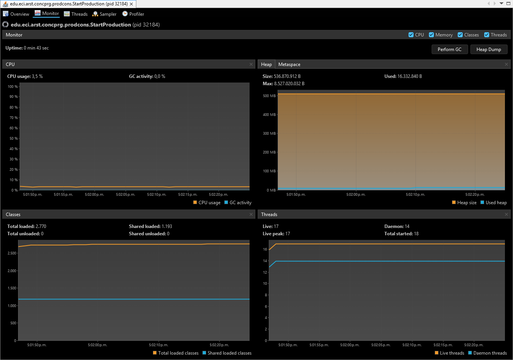
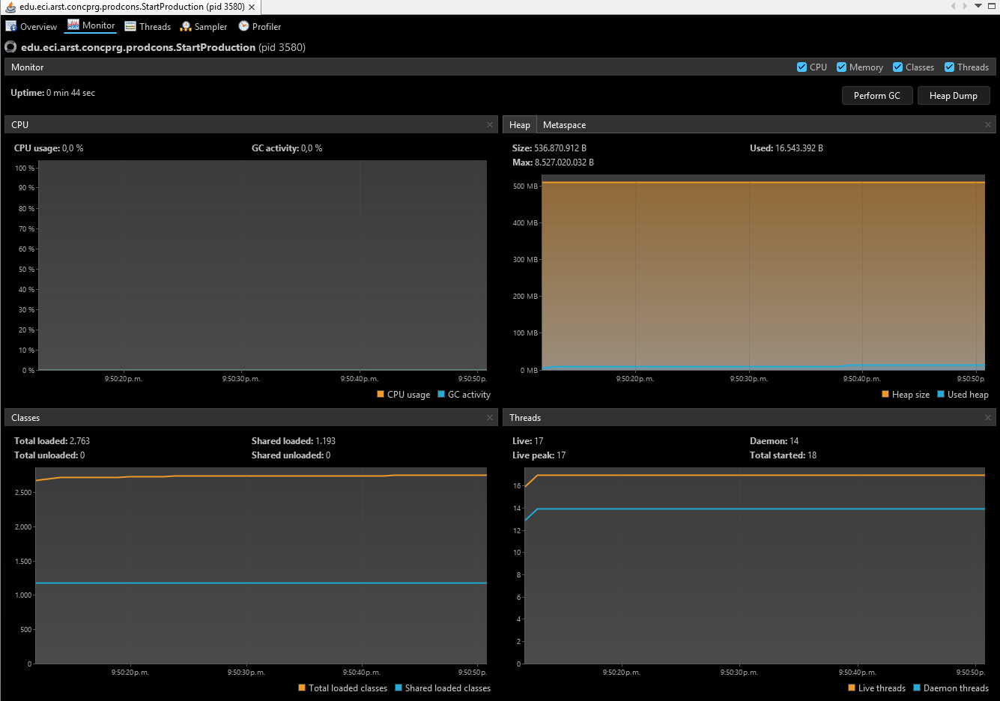
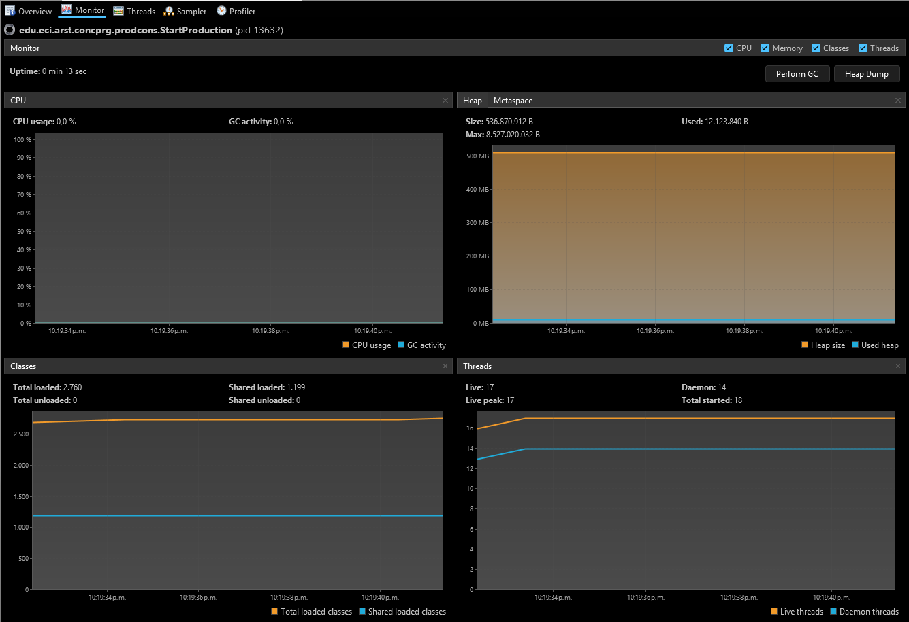

## Escuela Colombiana de Ingeniería
### Arquitecturas de Software – ARSW

#### Santiago Cajamarca y Sebastian Gonzalez.

### Parte I – Antes de terminar la clase.

Control de hilos con wait/notify. Productor/consumidor.

#### 1. Revise el funcionamiento del programa y ejecútelo. Mientras esto ocurren, ejecute jVisualVM y revise el consumo de CPU del proceso correspondiente. A qué se debe este consumo?, cual es la clase responsable?

El consumo elevado de CPU se debe a que el hilo consumidor realiza espera activa. Como el productor genera elementos lentamente y el consumidor trabaja rápidamente, la cola permanece vacía la mayor parte del tiempo. Sin embargo, el consumidor continúa ejecutando su ciclo while y consulta repetidamente si la cola tiene elementos. La clase responsable es Consumer, específicamente su método run(), porque el hilo permanece en estado ejecutable aunque no tenga elementos para consumir.

#### 2. Haga los ajustes necesarios para que la solución use más eficientemente la CPU, teniendo en cuenta que -por ahora- la producción es lenta y el consumo es rápido. Verifique con JVisualVM que el consumo de CPU se reduzca.

Para reducir el consumo de CPU, se agregó un mecanismo de coordinación mediante wait() y notifyAll(). Cuando la cola está vacía, el consumidor ejecuta wait(), libera el monitor de la cola y queda en estado WAITING. Después de agregar un elemento, el productor ejecuta notifyAll() para despertar al consumidor. De esta manera se elimina la espera activa y el consumidor deja de usar CPU mientras no hay datos disponibles. Al revisar nuevamente el proceso con VisualVM, se observa una reducción del consumo de CPU.

A diferencia de la imagne en el punto 1, el consumo de CPU es mucho menor (paso de 3.5% a 0.0%), porque el consumidor ya no ejecuta comprobaciones repetitivas mientras no hay elementos disponibles.

#### 3. Haga que ahora el productor produzca muy rápido, y el consumidor consuma lento. Teniendo en cuenta que el productor conoce un límite de Stock (cuantos elementos debería tener, a lo sumo en la cola), haga que dicho límite se respete. Revise el API de la colección usada como cola para ver cómo garantizar que dicho límite no se supere. Verifique que, al poner un límite pequeño para el 'stock', no haya consumo alto de CPU ni errores.

Para invertir las velocidades, se eliminó la pausa del productor y se agregó una pausa de un segundo al consumidor. También se reemplazó la cola por una ArrayBlockingQueue cuya capacidad se establece mediante stockLimit. El productor agrega elementos mediante put(), operación que lo bloquea cuando la cola alcanza su capacidad máxima. El consumidor retira elementos mediante take(). De esta forma, el límite del stock nunca se supera, no se presentan excepciones por llenar la cola y tampoco existe espera activa. En VisualVM se puede observar que el productor queda bloqueado cuando la cola está llena y el consumidor permanece en espera temporizada durante su pausa, por lo que el consumo de CPU se mantiene bajo.

## Parte III. – Avance para el martes, antes de clase.

### Sincronización y Dead-Locks.

#### 1. Revise el programa “highlander-simulator”, dispuesto en el paquete edu.eci.arsw.highlandersim. Este es un juego en el que:

- Se tienen N jugadores inmortales.
- Cada jugador conoce a los N-1 jugador restantes.
- Cada jugador, permanentemente, ataca a algún otro inmortal. El que primero ataca le resta M puntos de vida a su contrincante, y aumenta en esta misma cantidad sus propios puntos de vida.
- El juego podría nunca tener un único ganador. Lo más probable es que al final sólo queden dos, peleando indefinidamente quitando y sumando puntos de vida.

#### 2. Revise el código e identifique cómo se implemento la funcionalidad antes indicada. Dada la intención del juego, un invariante debería ser que la sumatoria de los puntos de vida de todos los jugadores siempre sea el mismo(claro está, en un instante de tiempo en el que no esté en proceso una operación de incremento/reducción de tiempo). Para este caso, para N jugadores, cual debería ser este valor?.

El valor del invariante para N jugadores:                                                                                                                                 
                                                                                                                                                                           
$$ \text{Suma total} = N \times 100 $$                                                                                                                                  
                                                                                                                                                                           
Por ejemplo, con los 3 inmortales por defecto: 300.   

#### 3. Ejecute la aplicación y verifique cómo funcionan las opción ‘pause and check’. Se cumple el invariante?.

Al inicio la suma se mantiene en 300, pero después de unos segundos empieza a desviarse (290, 310, 330...). La razón es una condición de carrera en fight() las operaciones de leer la salud del oponente, restarle el daño y sumársela al atacante no son atómicas. Cuando dos hilos atacan al mismo inmortal simultáneamente, ambos leen el mismo valor, ambos escriben sobre el mismo estado y uno de los dos golpes "se pierde", la vida deja de transferirse y simplemente desaparece o aparece de la nada. Además, la lista LinkedList se recorre con indexOf/get mientras otros hilos modifican su contenido, lo que agrupa el problema. Por eso, cada vez que se presiona Pause and check es muy probable que se vea una suma distinta a N×100.

#### 4. Una primera hipótesis para que se presente la condición de carrera para dicha función (pause and check), es que el programa consulta la lista cuyos valores va a imprimir, a la vez que otros hilos modifican sus valores. Para corregir esto, haga lo que sea necesario para que efectivamente, antes de imprimir los resultados actuales, se pausen todos los demás hilos. Adicionalmente, implemente la opción ‘resume’.

Para corregir la condición de carrera presente en la opción "Pause and check" se modificaron las clases Immortal y ControlFrame. En Immortal se agregó un candado compartido, que es un único objeto monitor inyectado por constructor y común a todos los inmortales de una misma partida, junto con una bandera booleana "paused". El método run() ahora ejecuta toda su iteración dentro de un bloque synchronized(fightLock); si la bandera paused está activa, el hilo se duerme mediante fightLock.wait(), lo cual libera el candado mientras espera. Adicionalmente se implementaron los métodos pause() y unpause(): el primero activa la bandera bajo el mismo candado y el segundo la desactiva y despierta a todos los hilos con fightLock.notifyAll().

En ControlFrame, el botón "Pause and check" ahora lanza un hilo auxiliar que toma el candado fightLock, pausa uno por uno a todos los inmortales, suma sus puntos de vida y finalmente actualiza la etiqueta de estadísticas a través de SwingUtilities.invokeLater, evitando bloquear el hilo de eventos de Swing (EDT). El botón "Resume", antes vacío, simplemente recorre la población llamando unpause() en cada inmortal. También se agregaron guardas para ignorar estos botones si el juego aún no ha iniciado.

#### 5. Verifique nuevamente el funcionamiento (haga clic muchas veces en el botón). Se cumple o no el invariante?.

La corrección es correcta por construcción: dado que toda pelea completa y toda escritura de la bandera ocurren bajo el mismo monitor, cuando el hilo verificador adquiere fightLock tiene la garantía de que ninguna pelea está a mitad de ejecución ni puede iniciar antes de que termine de leer los valores, por lo que la instantánea impresa siempre es consistente. Como efecto colateral positivo, al quedar las peleas serializadas desaparece el problema de lost updates y el invariante del juego (la suma de vida igual a N x 100) ya no se rompe durante la ejecución; como contrapartida, las pleas dejan de ser concurrentes entre sí.

#### 6. Identifique posibles regiones críticas en lo que respecta a la pelea de los inmortales. Implemente una estrategia de bloqueo que evite las condiciones de carrera. Recuerde que si usted requiere usar dos o más ‘locks’ simultáneamente, puede usar bloques sincronizados anidados:

Para esta parte se identificaron las regiones críticas relacionadas con la pelea de los inmortales y se reemplazó el candado global de la solución anterior por una estrategia de bloqueo más fina. La primera región crítica es el métodof ight(): la lectura de la salud del oponente, la escritura de la salud del oponente y el incremento de la salud del atacante deben ejecutarse de forma atómica respecto a ambos inmortales involucrados, pues si dos hilos atacan al mismo oponente simultáneamente ambos leen el mismo valor inicial y uno de los dos golpes se pierde, rompiendo el invariante del juego. La segunda región crítica es la toma de la instantánea global en Pause and check, que solo es válida si ninguna pelea está a mitad de ejecución. La tercera, el acceso a la lista de población, no es crítica en la implementación actual porque la lista es de solo lectura después de la creación de los inmortales.

La estrategia implementada asigna a cada inmortal su propio monitor, que protege su salud y sus banderas de control, eliminando el candado global. Con esto, dos peleas entre pares disjuntos de inmortales pueden ejecutarse en verdadera concurrencia, recuperando el rendimiento que se perdía al serializar todas las peleas. Para atacar, un hilo debe adquirir ambos locks mediante bloques sincronizados anidados, y dentro de ellos ejecutar la pelea completa, garantizando que la transferencia de vida sea atómica. Para evitar deadlock, los locks siempre se adquieren en un orden global consistente: antes de entrar a los bloques anidados, ambos participantes se ordenan por nombre y el hilo siempre toma primero el lock del inmortal menor; como todos los hilos respetan el mismo orden, es imposible formar el ciclo de espera circular que produce un interbloqueo.

#### 7. Tras implementar su estrategia, ponga a correr su programa, y ponga atención a si éste se llega a detener. Si es así, use los programas jps y jstack para identificar por qué el programa se detuvo.

Tras implementar la estrategia de bloqueo, el programa se ejecutó durante 15 segundos monitoreándolo con las herramientas jps y jstack. Primero se utilizó jps para obtener el PID del proceso Java en ejecución y luego jstack para tomar instantáneas del estado de todos los hilos en dos momentos distintos (t=6s y t=10s). El resultado fue que el programa  nunca se detuvo: el contador de peleas creció de forma estable a razón de aproximadamente 4.000 peleas por segundo (63. 052 peleas totales) y los volcades de jstack no reportaron ningún deadlock; los ocho hilos de inmortales aparecían en estado TIMED_WAITING (sleeping), es decir, ciclando normalmente en su pausa entre rondas sin bloqueos permanentes. Esto  ocurre porque la espera circular (condición necesaria del deadlock) es imposible cuando todos los hilos adquieren los locks en el mismo orden global.

Por otro lado, se ejecutó una variante con locks anidados sin orden consistente, donde cada hilo toma primero su propio lock y luego el del oponente. En ese caso el programa sí se detuvo por completo: quedó colgado y jamás alcanzó su finalización normal. El jstack lo diagnosticó explícitamente con el reporte Found one Java-level deadlock, mostrando el ciclo de espera circular entre los hilos (im0 esperaba el lock de im1, im1 el de im4, y así sucesivamente hasta cerrar el ciclo), con todos los hilos inmortales en estado BLOCKED. Incluso el hilo principal quedó congelado al intentar leer la salud de un inmortal atrapado en el ciclo, lo que evidencia cómo un deadlock se propaga a otros hilos que solo quieren consultar el estado. Se concluye que la detención del programa solo se presenta en la variante sin ordenamiento de locks, y que la estrategia implementada la previene por construcción. 

#### 8. Plantee una estrategia para corregir el problema antes identificado (puede revisar de nuevo las páginas 206 y 207 de Java Concurrency in Practice).

Para corregir el deadlock identificado se aplicó la estrategia de Java Concurrency in Practice para los deadlocks de orden dinámico de locks: inducir un orden global de adquisición basado en una clave única e nmutable de los objetos involucrados, en lugar del orden accidental en que cada hilo los solicita. Siguiendo el patrón canónico del libro, antes de pelear cada hilo calcula System.identityHashCode() de ambos participantes y adquiere siempre primero el lock del objeto con hash menor y después el del mayor; como todos los hilos siguen la misma regla, es imposible formar el ciclo de espera circular que producia el bloqueo. Adicionalmente se incluyó el tie-lock del libro: si los hashes de ambos inmortales colisionan, se toma antes un lock estático compartido que serializa esas peleas empatadas, preservando así un orden total. La solución se verificó ejecutando la simulación con 8 inmortales: en 10 rondas de pausa/verificación/reanudación la suma de vida se mantuvo exactamente en 800, y al correr el programa libremente durante 15 segundos bajo monitoreo con jps y jstack no se reportó ningún deadlock, con los hilos ciclando normalmente a 4.000 peleas por segundo.

#### 9. Una vez corregido el problema, rectifique que el programa siga funcionando de manera consistente cuando se ejecutan 100, 1000 o 10000 inmortales. Si en estos casos grandes se empieza a incumplir de nuevo el invariante, debe analizar lo realizado en el paso 4.

No fallo.

#### 10. Un elemento molesto para la simulación es que en cierto punto de la misma hay pocos 'inmortales' vivos realizando peleas fallidas con 'inmortales' ya muertos. Es necesario ir suprimiendo los inmortales muertos de la simulación a medida que van muriendo. Para esto:

- Analizando el esquema de funcionamiento de la simulación, esto podría crear una condición de carrera? Implemente la funcionalidad, ejecute la simulación y observe qué problema se presenta cuando hay muchos 'inmortales' en la misma. Escriba sus conclusiones al respecto en el archivo RESPUESTAS.txt.
- Corrija el problema anterior SIN hacer uso de sincronización, pues volver secuencial el acceso a la lista compartida de inmortales haría extremadamente lenta la simulación.

Eliminar los inmortales muertos de la población sí introduce una condición de carrera: la lista es compartida por todos los hilos y mutarla (remove) mientras otros la recorren para elegir oponente o calcular estadísticas corrompe su estructura interna. Al implementar la eliminación directamente sobre la LinkedList original y ejecutar la simulación con 1000 inmortales, el programa colapsó de inmediato con una java.util.ConcurrentModificationException en el hilo que recorre la lista y una cascada de NullPointerException en los hilos peleadores dentro de LinkedList.get(), pues las eliminaciones concurrentes rompen los enlaces internos de los nodos que otros hilos están navegando, haciendo que los hilos mueran en cadena. El problema se corrigió sin agregar sincronización reemplazando la LinkedList por una java.util.concurrent.CopyOnWriteArrayList, cuyos iteradores operan sobre una instantánea inmutable del arreglo interno y cuyas lecturas no requieren locks; el costo O(n) de copiar el arreglo en cada eliminación es aceptable porque las muertes son eventos poco frecuentes frente al volumen de peleas. Adicionalmente se detectó y corrigió una fuga sutil de consistencia: un inmortal asesinado mientras dormía entre rondas ejecutaba un golpe antes de verificar su estado, robando vida a un sobreviviente; para evitarlo se verifica la bandera dead dentro de la sección crítica de la pelea. Con la corrección, la simulación con 1000 inmortales ejecuta sin ninguna excepción, la población se reduce correctamente a medida que mueren y la suma de vida se conserva exactamente en N x 100 durante toda la partida.